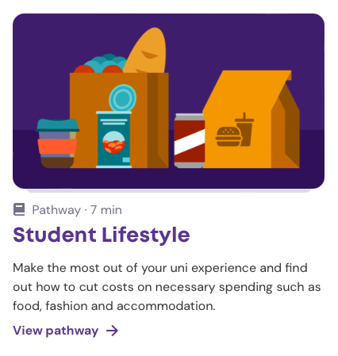

# Frontend Engineer Coding Test

The aim of this test is for us to be able to assess your ablity to build a well-crafted React Native application, and also to see how you go about solving the problem. We will use it as the basis of a discussion in the next interview stage. There are no trick questions or hard rules on what you need to do.

## Brief

We would like you to build a fast, accessible and responsive (think about how the screen will look on different device sizes) library screen. The items in the library will be learning pathways that can be retrieved from our development API.

When the screen loads, you should fetch the data to render the pathways.

The library items on our web platform look like this. If you want to copy the styles and adapt them for a mobile application, feel free to do so. Alternatively, you can be as creative as you like with them.

Some ideas of things to think about, if you get the time:

- Sorting
- Pagination (the api doesn't support this, but you could implement it on the frontend)
- Testing

## Data

We've provided a development api endpoint that can be accessed using the following URL:

[https://www.blackbullion.com/api/_dev/pathways](https://blackbullion.com/api/_dev/pathways)

## Technology

Feel free to use any external libraries to enhance your React Native solution. We do not expect you to implement things like navigation or state management from scratch.

## Deliverable

Please email us once you have completed the task with a link to a repository. Be sure to include a set of instructions on how to install dependencies and run the project.

If you have any questions please email [tudor@blackbullion.com](mailto:tudor@blackbullion.com)
