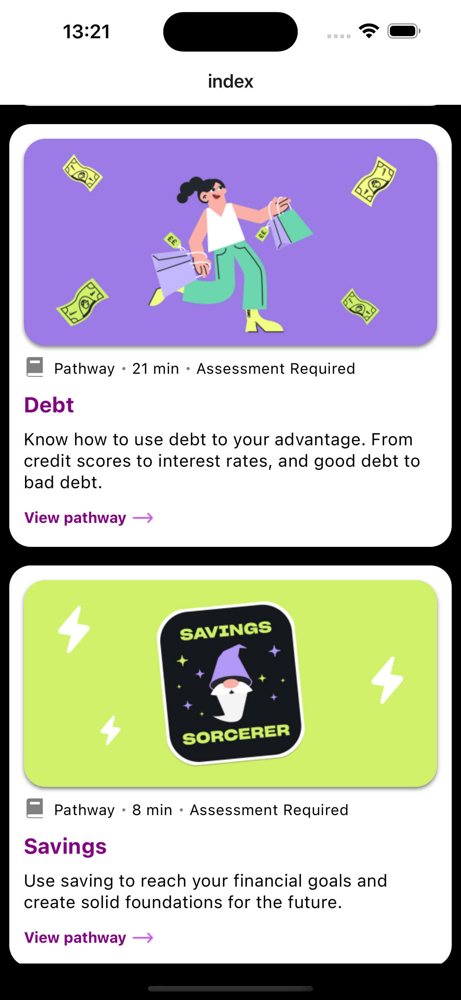

# Blackbullion Frontend dev test app

Hi, this is my attempt at the Blackbullion front-end dev test app. I have included the initial instructions in the Instructions.md file. 

## Get started
To get the app up and running, you will need to run the following steps below. Additionally you will need to ensure that you have your environment set up for expo emulation following the React-Native guides [here](https://reactnative.dev/docs/set-up-your-environment)

Next you will need to ensure you have a node version manager (NVM) installed. You can download NVM by following the instructions [here](https://www.freecodecamp.org/news/node-version-manager-nvm-install-guide/).

After that you are free to begin the setup by folliwng the steps below: 


1. Switch to the correct NVM version
   
   ```
   nvm use
   ```

   This will switch you to a version of node which is usable with this project. You may need to install this version of node if you do not already have it in your version manager


 2. Install dependencies

      ```
      npm install
      ```

3. Start the app

   ```
   npm run start
   ```

   Once the app has started, it will begin running metro. You will have a choice of running the app either on an Android emulator, iOS simulator or even your own device if you scan the expo QR code. 

   Once the app is loaded, you should be met by the following screen: 

   

## Testing 

To run tests in this app please run the following command:
```
   npm run test
```

To stop the tests and close down the watcher press Ctrl+C in the terminal.

## Linting
This app is setup with a basic expo linter. To run the linter please run:
```
   npm run lint
```

